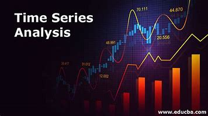
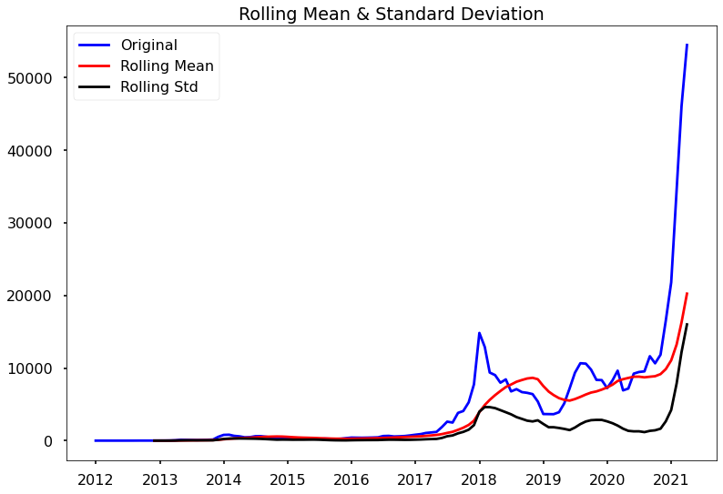
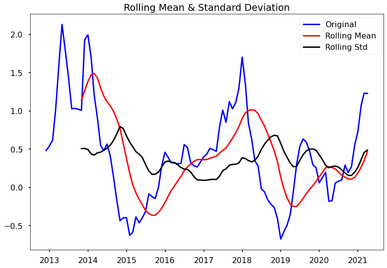
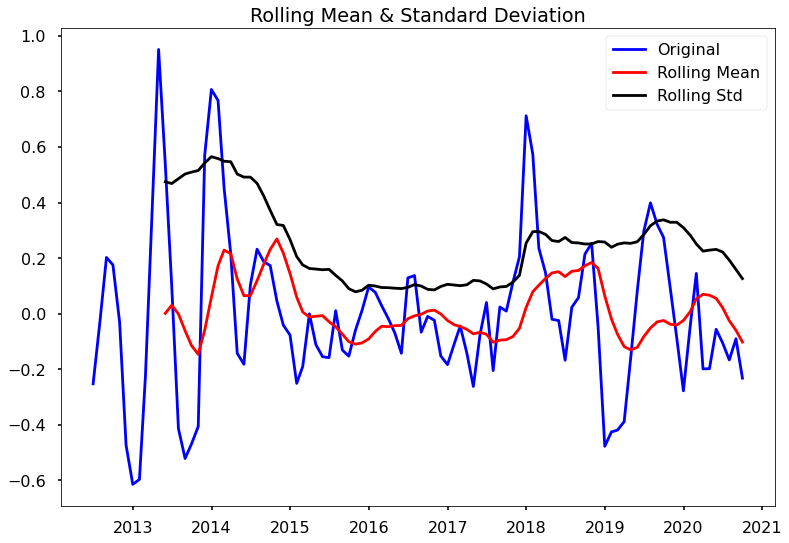
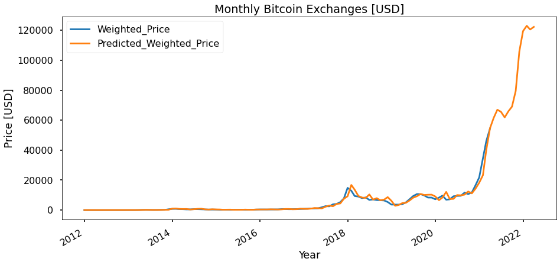

# Time Series Analysis

## Overview
For this project, I used Bitcoin's daily closing market price dataset from Jan 2012 to March 2021 (the dataset can be found on [kaggle](https://www.kaggle.com/datasets/mczielinski/bitcoin-historical-data). The main objective of this work includes the following:
- To explain how to analyse a time series and forecast its values.
- To forecast sales and cryptocurrencies using ARIMA and GARCH models.

## What is Time Series Analysis?
A time series is a collection of observations made over time, often at equal intervals. We can forecast future values using the series' analysis and previously recorded values, and one of its major areas of application is business forecasting. There are two variables in a time series: time and the variable we want to forecast.

## Components of a Time Series:
* <b>Trend:</b> Upward & downward movement of the data with time over a considerable period. Eg: Appreciation of Dollar against Naira.
  
* <b>Seasonality:</b> It is an expected variation in a time series of data brought on by recurring patterns or events at particular periods of the year. For example, periodic increment in the sale of ice cream every summer.
  
* Cyclicity: The repeating pattern over a longer period of time. Long-term economic, social, or political trends produce this expected fluctuation in time series data. For instance, employment records exhibit a cyclical pattern that illustrates the tendency of employment rates to rise and decline over several years.
  
* <b>Noise:</b> The term "noise" describes data fluctuations that are arbitrary or unpredictable and do not correspond to any underlying trend or pattern. Measurement errors, random oscillations, and unexpected events are a few of the many things that can generate noise.

## For this project, I employed two models. These are ARIMA and GARCH models

- ARIMA Model: Three components, AR (Auto Regressive), I (integrated) and MA (Moving average), are combined to create ARIMA (Auto Regressive Integrated Moving Average) (Moving Average). It has three hyperparameters, P for autoregressive lags, d for order of differentiation, and Q for moving average, derived from the AR, I, and MA components, respectively. The association between previous and current periods is the AR component. The MA portion is utilized to reduce noise. The AR and MA sections are joined by the I part. ACF(Auto Correlation Function) & PACF(Partial Auto Correlation Function) plots are used to find the values for p and q.
  - ARIMA is a frequently used statistical model for time series analysis and forecasting in industries including economics, finance, and marketing.

- A statistical model called GARCH (Generalized Autoregressive Conditional Heteroscedasticity) examines and predicts the variance or volatility of time series data. Modelling the volatility of asset returns, such as stock prices or exchange rates, is a popular application. Alpha and beta are the two parameters that define the GARCH model. The parameters alpha and beta quantify the influence of previous errors and variance on the current variance.
  - The alpha and beta values range from 0 to 1, and it is typical to choose values between 0.1 and 0.9.

## ARIMA MODEL
There is a need to make the time series stationary to use ARIMA. And as briefly introduced, the ARIMA model is defined by three terms:
- **p:** The order of the auto-regressive term
- **q:** The order of the moving average term
- **d:** The number of differencing required to make the time serie stationary

I won't go into exhaustive detail. However, the core ideas for finding these parameters will be outlined.

The plot above demonstrates that, despite the rolling standard deviation being largely steady over time, the rolling mean has a trend component. Our rolling statistics, such as mean and standard deviation, must be constant over time for our time series to be stationary. As a result, both curves must be parallel to the x-axis, which is not the case in our example.

To further augment that the time series is not stationary, let us perform the ADCF test.

| Dickey Fuller Test:  |            |
|----------------------|------------|
| Test Statistic       |   2.146295 |
| p-value              |   0.998835 |
| #Lags Used           |   1.000000 |
| n_observations       | 110.000000 |
| Critical Value (1%)  |  -3.491245 |
| Critical Value (5%)  |  -2.888195 |
| Critical Value (10%) |  -2.580988 |

The following conditions must be met by the ADCF test for a time series to be stationary:
- p-value 0.05
- critical values very close to the test statistics

We can reasonably conclude that our time series is not stationary because our data do not meet these conditions. Hence the need for transformation. Here are some common methods for transforming time series data to make it more stationary:
- Box-Cox transformation
- Log transformation
- Seasonal decomposition
- Detrending
- Differencing

| Dickey Fuller Test:  |            |
|----------------------|------------|
| Test Statistic       |  -3.410693 |
| p-value              |   0.010600 |
| #Lags Used           |   7.000000 |
| n_observations       |  93.000000 |
| Critical Value (1%)  |  -3.502705 |
| Critical Value (5%)  |  -2.893158 |
| Critical Value (10%) |  -2.583637 |

> Following the log transformation:
- The p-value dropped from 0.999 to 0.011 which is below 0.05
- The important values for the confidence intervals of 1%, 5%, and 10% are fairly near the test statistic.
- As a result of the first two points, we can conclude that the provided series is stationary.
- Perform seasonal decomposition

> Other transformation like exponential decomposition can also be done to increase accuracy

| Dickey Fuller Test:  |            |
|----------------------|------------|
| Test Statistic       |  -3.474170 |
| p-value              |   0.008676 |
| #Lags Used           |   7.000000 |
| n_observations       |  92.000000 |
| Critical Value (1%)  |  -3.503515 |
| Critical Value (5%)  |  -2.893508 |
| Critical Value (10%) |  -2.583824 |

> Following the transformation:
- The p-value dropped from 0.011 to 0.009 which is below 0.05
- The important values for the confidence intervals of 1%, 5%, and 10% are fairly near the test statistic.

## Build Model
<h2>Final Prediction Plot</h2>

## GARCH MODEL
[Check notebook](bitcon-prediction-arima-garch-models.ipynb#garch_model)

## Access on

